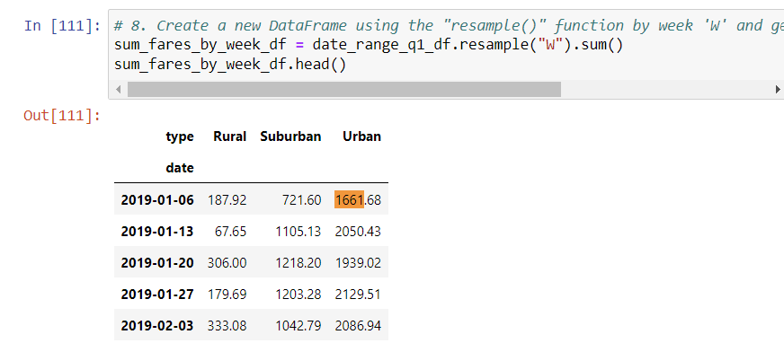

# PyBer_Analysis

## Overview of the Analysis
As a data analyst for PyBer, a python-based riding sharing company 
Our task are as following 
- to perform exploratory analysis on data on large csv, 
- create different types of viz to tell a compelling story about the data
- Write python scripts using Panda’s libraries, the Jupyter notebook and MatplotLib to create a variety of charts to showcase the relationship between the types of cities, and the number of drivers and riders, and percentage of total fares, riders and drivers by type of city 
The analysis and viz we produce will help PyBer improve access to ride-sharing services and determine affordability for underserved neighborhoods

## Results
There were three types of localities
-urban
-sub urban
- rural
Table below shows
-urban cities have significantly larger number of drivers 
-this is a reflection of population which affects the demand and hence higher price

Graph below shows linear trends of Total fare by city.
Graph shows urban has the highest fare and this could be due to highest demand and opposite is true for rural cities

## Summary
1. There is less demand in rural area. Demand could be increased by providing incentives to drivers and passengers both to join the riding sharing services. This could be done by incentives over referrrals, registration with the company, etc.
2. Rdie sharing should not be restricted to just bike or cars. Usually mode of transportation in rural areas are different than in urban, keeping this fact in mind ride sharing should be flexbile and offer more options
3. Ride sharing should be available for deliveries as well. This will see a massive increase in demand and would reduce disparity
